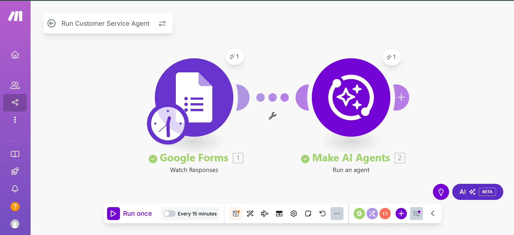

 
 

# Make.com Customer Service Agent Workflow

## 📌 Overview
This repository contains a **Make.com automation workflow** that integrates:  
- Google Forms (for collecting customer queries)  
- Make AI Agents (for intelligent automated responses)  

The workflow watches for new Google Form responses, then passes the input to a **custom AI Agent** which generates a meaningful reply or action automatically.

## ⚙️ Tools & Services Used
- **Make.com** – Automation platform  
- **Google Forms** – To capture customer responses  
- **Make AI Agents** – To process the response and provide intelligent output  

## 🛠️ Workflow Steps
1. **Google Forms Trigger** → Watches for new form responses.  
2. **AI Agent Processing** → Runs a Make AI Agent to generate a response based on the form input.  

## 📸 Workflow Screenshot

## 🚀 How to Use
1. Import the `sanitized_customer_service_agent.json` file into your Make.com account.  
2. Reconnect your own Google Forms and Make AI Agent connections.  
3. Replace placeholder values (`YOUR_FORMID_HERE`, `YOUR_AGENT_HERE`, etc.) with your actual IDs.  
4. Run the scenario to test the automation.  

## 🔐 Security Notes
- All **emails, form IDs, agent IDs, and connection details** have been sanitized.  
- Before running, update the workflow with your own credentials.  

## 📖 About Me
I am learning and exploring **AI-powered automation** with Make.com and its AI Agent capabilities.  
This project shows how businesses can use AI to provide **fast, automated customer support** from form submissions.  

👉 Connect with me on [LinkedIn](https://www.linkedin.com/in/muhammadahmad999/)  
